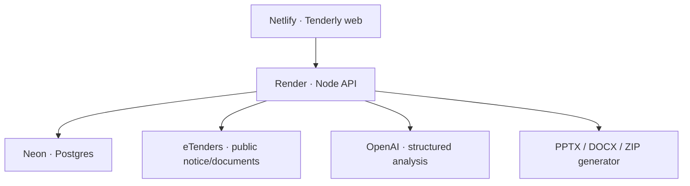

# Tenderly

Tenderly is a bidder-side workspace for Irish public tenders. It discovers public opportunities from eTenders, imports an individual tender by URL, reads the tender pack, qualifies the bidder against hard requirements, produces a 1–3 slide synopsis, turns scored criteria into a response workspace, and assembles a controlled submission ZIP.

The most important product rule is deliberate: **Tenderly does not turn missing evidence into a green tick.** Missing or conflicting evidence is `Review`; a final ZIP stays locked until mandatory items are resolved.

## What is implemented

- Public eTenders current-opportunity watcher with low-rate crawling and company-profile matching.
- Paste an `etenders.gov.ie` opportunity URL to import the notice and public tender documents.
- PDF, DOCX, XLSX, PPTX, ZIP, TXT, CSV, XML and JSON text extraction with bounded ZIP/spreadsheet processing. Legacy `.xls` files are retained but must be converted/exported before text qualification.
- Source-linked AI tender analysis: open/restricted/invited access, framework establishment vs existing-framework mini-competition, fatal eligibility gates, fit score, partner gaps, deadlines, roles, evaluation weights, questions, clarification points and submission rules.
- 1–3 slide `.pptx` synopsis generation.
- Company profile, evidence library and CV/person records in Postgres/Neon.
- Evidence-bound response drafting. Evidence must be explicitly verified before the bid writer can use it; missing facts become `[INPUT NEEDED: ...]` rather than invented claims.
- CV ingestion and sourced role matching: required tender roles are matched against uploaded CV facts, with missing proof left as `Review` and a concrete CV/partner action.
- Human `Reviewed & ready` state for scored answers.
- Tender source-file and completed buyer-template uploads.
- Draft ZIP generation at any time; final ZIP generation is blocked by unresolved eligibility, unanswered required questions, incomplete buyer templates, signatures or pricing items.
- Daily background discovery job and stored match notifications.
- Email/password workspace authentication with bcrypt password hashing and signed 12-hour sessions.
- SSRF protection: arbitrary pasted URLs are not fetched; automatic procurement fetches are restricted to official eTenders hosts.
- Responsive, keyboard-friendly bidder cockpit shared by the Netlify build and the development preview.

## Architecture



The browser never talks to Neon or OpenAI directly. Secrets stay on Render.

## Local run

Requirements: Node.js 22+.

### 1. API

```bash
cd server
cp .env.example .env
npm ci
npm run dev
```

For a quick local demo, `DATABASE_URL` and `OPENAI_API_KEY` can be blank. The API then uses in-memory storage and conservative non-AI qualification. For real tender work, configure both.

### 2. Web

In a second terminal from the repository root:

```bash
cp .env.example .env
npm ci
npm run dev:netlify
```

Open the local Vite URL. `VITE_API_URL=http://localhost:8787` connects the UI to the API. If `VITE_API_URL` is blank, the UI intentionally runs its built-in demonstration workspace.

## Deploy: Neon → Render → Netlify

### Neon

1. Create a Neon Postgres project/database.
2. Copy its Postgres connection string.
3. Use it as `DATABASE_URL` in **both** Render services in `render.yaml` (web API and cron job).
4. The API runs the idempotent schema in `server/migrations/001_init.sql` on startup.

### Render

This repository includes `render.yaml` for a web API plus a daily discovery cron job.

The discovery job runs at `07:15 UTC` each day (`08:15` in Ireland during summer time). Render cron jobs do not have a free plan, so the Blueprint makes its `starter` plan explicit. If you want to launch at minimum cost, remove the `tenderly-discovery` cron block before creating the Blueprint; manual **Refresh live** discovery in the web app still works.

Required secret values:

- `DATABASE_URL` — Neon connection string.
- `OPENAI_API_KEY` — server-side key used for tender qualification/drafting.

Generated/configured values:

- `JWT_SECRET` — generated by Render for the web service.
- `OPENAI_MODEL` — defaults to `gpt-5.6` and can be changed by environment setting.
- `CORS_ORIGINS` — already set to `https://tenderly.netlify.app`; add future custom domains comma-separated.

Once the web service is healthy, copy its public URL, for example `https://tenderly-api.onrender.com`.

### Netlify

The root `netlify.toml` is ready to use.

1. Connect the repository to Netlify with the repository root as the base.
2. Add `VITE_API_URL=<your Render API URL>` in Netlify environment variables. Do not add a trailing slash.
3. Deploy. The configured publish directory is `dist-netlify`.
4. Point/keep the site at `https://tenderly.netlify.app`.
5. Visit `<Render URL>/health`; it should report `database: configured` and `ai: configured` before using a real bid.

## How a real bid flows

1. **Discover** — Tenderly checks current public opportunities and provides a cheap keyword/CPV fit preview. This is *not* final eligibility.
2. **Import** — open a recommended opportunity or paste its eTenders URL. Tenderly imports the public notice and public documents it can access.
3. **Complete source** — if eTenders requires a signed-in supplier session for a file, download that file yourself and upload it to the Tenderly bid. Tenderly never asks for or stores your eTenders password.
4. **Qualify** — hard gates run before fit scoring. A framework-establishment competition is not treated as closed merely because it says “framework”. Existing-framework mini-competitions require explicit source evidence of restricted membership/invitation.
5. **Synopsis** — review the 1–3 slide brief and download the `.pptx`.
6. **Respond** — scored questions, weights and word limits become response sections. Draft from approved evidence, then explicitly mark each response reviewed/ready.
7. **Assemble** — upload completed buyer templates, pricing schedules and signed files with the `submission` role. Build a draft ZIP whenever useful.
8. **Submit** — final ZIP unlocks only when automated blockers are clear. A human performs the final eTenders upload/submit action.

## Important eTenders boundary

Public opportunity metadata and many tender-document pages are readable without a supplier login, but some documents or submission workspaces can require portal access. Tenderly deliberately does not automate supplier credentials or the final portal submit action. If a source file is not publicly downloadable, the safe path is: download it in your authenticated eTenders session, then upload the file into Tenderly.

The eTenders HTML connector is isolated in `server/src/etenders.ts`. If the portal changes its markup, update this one module and the parser fixtures/tests rather than the bid workflow.

## Safety/readiness rules

- `PASS` requires affirmative bidder evidence plus a tender requirement it actually satisfies.
- Missing bidder data becomes `REVIEW`, not `FAIL` or `PASS`.
- `FAIL` is reserved for an explicit mandatory mismatch.
- “Framework” alone never means “framework members only”.
- AI-generated bid answers start as drafts even when no input is missing; the bidder must mark them ready.
- The final ZIP refuses to build while fatal gates are `REVIEW`/`FAIL`, required answers are not ready, or mandatory buyer-file checklist items are incomplete.
- Tenderly prepares the submission package; it does not make the final legal/commercial submission on the bidder's behalf.

## Tests and production builds

API:

```bash
cd server
npm run build
npm test
```

Netlify web build:

```bash
npm run build:netlify
```

The API tests cover eTenders parsing and URL restrictions, document extraction, final-pack blocking, preview scoring, ZIP creation and real PPTX generation.

## Key API routes

- `POST /api/auth/register`, `POST /api/auth/login`
- `GET/PUT /api/company`
- `GET /api/tenders/discover`
- `POST /api/tenders/import`
- `POST /api/tenders/:id/documents`
- `POST /api/tenders/:id/analyse`
- `POST /api/tenders/:id/answers/:questionId/draft`
- `PUT /api/tenders/:id/answers/:questionId`
- `GET /api/tenders/:id/deck`
- `GET /api/tenders/:id/red-team`
- `GET /api/tenders/:id/pack?draft=true|false`
- `GET/POST /api/evidence`, `POST /api/evidence/upload`, `PUT /api/evidence/:id/verification`
- `GET/POST /api/people`, `POST /api/people/upload`
- `GET /api/notifications`

`GET /health` is public and intentionally reports only configuration state, never secret values.
