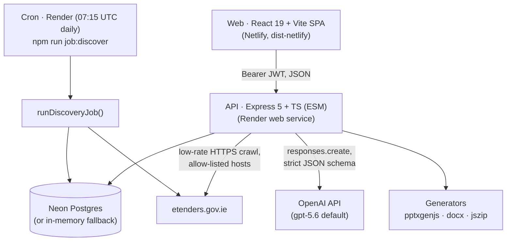

# Tenderly — Current Architecture (v1 audit)

Audit date: 2026-08-19 · Branch: `TLY-0-bootstrap` · Auditor: engineering agent (Phase 0)

> **Update (TLY-19, TLY-20).** The v1 source is now committed at the repository root, and the
> vestigial Next.js / Cloudflare Worker / D1 / Drizzle scaffolding has been removed. The stale
> `origin/copilot/tenderly-application-development` branch is archived as tag `archive/copilot-v0`.
> Sections below describing that scaffolding are kept only where they explain how the code got
> here; the live layout is the table in section 2.

---

## 1. System overview

Tenderly v1 is a single-tenant bidder workspace for Irish public tenders (eTenders). One user
account owns exactly one company profile — `docs/TENANCY.md` records the agreed design for
replacing that with organisations and memberships, and the migration path to it. The system discovers opportunities, imports a tender by
URL, extracts text from the tender pack, runs AI qualification and drafting, and assembles a
gated submission ZIP. Final submission is always a human action on eTenders.



The browser never talks to Postgres or OpenAI. All secrets live on Render.

## 2. Repository layout (real vs vestigial)

| Path | Status | Purpose |
|---|---|---|
| `tenderly-v1-source/components/TenderlyApp.tsx` | **Real** | Entire web UI: ~974-line monolith. All types, state, API client, and every screen (Discover, My bids, Evidence, Team, Company, Settings; bid stages Qualify → Synopsis → Respond → Assemble → Submit) in one file. |
| `tenderly-v1-source/web-static/` | **Real** | Vite entry (`index.html`, `main.tsx` → renders `TenderlyApp`). |
| `tenderly-v1-source/vite.netlify.config.ts` | **Real** | The production web build (`dist-netlify`); injects `VITE_API_URL` at build time; blank ⇒ built-in demo workspace. |
| `tenderly-v1-source/server/` | **Real** | The API. See §3. |
| `tenderly-v1-source/netlify.toml`, `render.yaml` | **Real** | Deploy config (§6). |
| `tests/rendered-html.test.mjs` | Removed (TLY-20) | Asserted on the Cloudflare Worker build output; deleted with the Worker. |

## 3. API server (`tenderly-v1-source/server/`)

Express 5, TypeScript strict ESM, Node ≥ 22. Single process, ~1,700 LOC across 11 modules.

| Module | Responsibility |
|---|---|
| `src/index.ts` (362) | App wiring: helmet, CORS allow-list, 2 MB JSON limit, auth rate-limit (30 req/15 min on `/api/auth/*` only), multer memory uploads (25 MB, 1 file), Zod validation on every route, `safeError()` mapping, all ~25 routes. |
| `src/auth.ts` (33) | HS256 JWT (12 h, issuer/audience-pinned), `requireAuth` middleware mounted on all `/api` after the auth + cron routes. Prod refuses to boot if `JWT_SECRET` < 32 chars. No logout/revocation, no password reset. |
| `src/db.ts` (316) | Dual persistence: `pg.Pool` (max 5, `rejectUnauthorized:false` for non-localhost) **or** in-memory Maps when `DATABASE_URL` is blank. Idempotent SQL migration executed at boot. Every tenant query filters by `account_id` in SQL. |
| `src/etenders.ts` (245) | The only outbound-fetch surface. SSRF containment: HTTPS-only, host allow-list (`etenders.gov.ie`), redirect re-validation, credential-URL rejection, 18 s timeout, size caps (6 MB HTML / 20 MB docs). Search-page crawler with polite delay + page cap; notice importer via label-scanning of detail-page text; public document list/download; keyword `scoreTenderPreview` (cheap, non-AI). |
| `src/documents.ts` (103) | Text extraction: PDF (`pdf-parse`), DOCX (`mammoth`), XLSX (`exceljs`, row/col/sheet caps), PPTX (regex over slide XML), ZIP (35-entry cap, `__MACOSX`/`../` filtered, recursive), TXT/MD/CSV/XML/JSON. `.xls` explicitly unsupported. Per-file 180 k-char cap; combined source capped at 700 k chars. |
| `src/ai.ts` (192) | OpenAI `responses.create` with `strict: true` JSON-schema outputs for analysis + drafting. System prompts encode the moat: REVIEW-not-FAIL for missing evidence, framework≠closed, `[INPUT NEEDED: …]`, evidence quotes with source labels, only `verified` evidence is sent. Deterministic `sourceFallback()` when no key. Prompts are inline strings; no versioning, no token-usage capture, no streaming, no injection delimiting of document text. |
| `src/pack.ts` (163) | `submissionBlockers()` (eligibility ≠ PASS, gate FAIL/REVIEW, required answers not `ready`, checklist items not READY, missing `submission`-role uploads) gates the final ZIP; draft ZIP always allowed and includes internal readiness report + evidence register + deck. DOCX response/CVs via `docx`, PPTX deck (≤3 slides) via `pptxgenjs`. |
| `src/jobs.ts` / `src/job.ts` | Daily discovery: crawl once, score against **every** company, `saveNotification` upsert above threshold (default 45). CLI wrapper exits 0/1; console-only logging; also exposed as `POST /api/jobs/discover` guarded by `CRON_SECRET` bearer. |
| `src/serializers.ts` (107) | Maps `TenderRecord`+analysis+answers to the UI wire shape (gates, questions with per-answer status, roles, checklist with `checklistOverrides` merge, decision derivation). |
| `src/types.ts` (156) | Shared server-side domain types. **Not shared with the web app** — the UI re-declares its own copies in `TenderlyApp.tsx`. |

### Request flows

**Import** — `POST /api/tenders/import` → `assertSafeProcurementUrl` → fetch notice → `extractResourceId` → fetch detail page → `extractStructuredFields` (33 known labels) → `upsertTender` (unique `account_id+source+external_id`) → best-effort public-doc download (HTML content-type ⇒ "requires portal access" warning) → text extraction → `saveDocument` → inline `analyseSavedTender` (analysis errors reported, non-fatal) → serialized tender + warnings.

**Analysis** — notice text + all extracted docs + company + people + **verified** evidence → one OpenAI call → strict-schema `TenderAnalysis` persisted to `tenders.analysis` (status → `ANALYSED`).

**Drafting** — per scored question; prior answers included; result saved as `needs-input` if `missingInputs` non-empty, else `draft`. Human must PUT status `ready`.

**Final pack** — `GET /api/tenders/:id/pack?draft=false` refuses (409 + blocker list) while `submissionBlockers()` is non-empty.

## 4. Data model (Neon Postgres, `migrations/001_init.sql`)

```
users (id, email UNIQUE, password_hash)
companies (account_id UNIQUE → users, 8 structured text cols + profile_json jsonb)   -- 1:1 user↔company
tenders (account_id → users, UNIQUE(account_id, source, external_id),
         metadata jsonb, analysis jsonb, status IMPORTED|ANALYSED)
tender_documents (tender_id →, role source|submission|evidence, bytes bytea,
                  extracted_text, extraction_status)                                  -- files stored in-DB
bid_answers (tender_id →, UNIQUE(tender_id, question_id), status draft|ready|needs-input,
             evidence_json jsonb)
evidence_library (account_id →, kind, name, content text, tags jsonb, verified bool)  -- text-only evidence
people (account_id →, name, title, cv_text, skills jsonb)
notifications (account_id →, UNIQUE(account_id, external_id), match_score, payload jsonb)
```

Indexes: PKs, unique constraints, `tender_documents(tender_id)`, `notifications(account_id, created_at DESC)` only. Analysis and metadata are unversioned jsonb blobs; question IDs in `bid_answers` reference IDs inside the analysis blob (re-analysis can orphan answers). All deletes cascade from `users`. No migration framework — one idempotent file re-run at every boot.

## 5. Web app

React 19 SPA, no router — section/stage navigation is component state inside `TenderlyApp.tsx`. Inline `fetch` API client with Bearer token kept in `localStorage`-backed state; demo mode when `VITE_API_URL` is blank. All wire types duplicated by hand from the server. CSS in `components/tenderly.css`. No component tests; one built-HTML smoke test.

## 6. Deployment topology

| Layer | Service | Config |
|---|---|---|
| Web | Netlify (`tenderly.netlify.app`) | `netlify.toml`: build `npm run build:netlify`, publish `dist-netlify`, SPA redirect, security headers. Env: `VITE_API_URL`. |
| API | Render web service `tenderly-api` | `render.yaml`: Node 22, health check `/health`, autodeploy on commit. Env: `DATABASE_URL`, `OPENAI_API_KEY`, `OPENAI_MODEL=gpt-5.6`, generated `JWT_SECRET`/`CRON_SECRET`, `CORS_ORIGINS`, crawler tuning. |
| Cron | Render cron `tenderly-discovery` (starter plan) | `15 7 * * *` daily; own build; shares `DATABASE_URL`. |
| DB | Neon Postgres | Schema applied by API at boot. |

No CI. No staging. Deploys are git-push-to-prod (Render) and Netlify auto-builds; the manual `DEPLOYMENT_CHECKLIST.md` is the release process.

## 7. Security posture (as implemented)

- **Works:** helmet; strict CORS allow-list; bcrypt(12); JWT issuer/audience pinning with prod secret-length guard; Zod on every input; SSRF allow-listing with redirect re-validation and size/time caps; ZIP path-traversal filtering; multer memory limits; filename sanitisation on generated files and Content-Disposition parsing; cron endpoint secret; `safeError` hides internals in prod; tenant scoping via `account_id` on every SQL query.
- **Absent:** rate limiting beyond `/api/auth/*`; logout/revocation; password reset; audit trail; structured logging/error tracking; prompt-injection delimiting of tender text (document content is concatenated raw into the model input); MIME sniffing (extension-only dispatch); per-account storage quotas; encryption-at-rest controls beyond provider defaults; automated cross-tenant tests.

## 8. Honest inventory — what works today

1. End-to-end happy path: register → import eTenders URL → auto document fetch + extraction → AI analysis with source-quoted gates → draft answers with `[INPUT NEEDED]` → human `ready` marking → deck download → draft ZIP → blocker-gated final ZIP.
2. The two product-moat rules are genuinely enforced in code (`ai.ts` prompts + schema, `pack.ts` blockers), not just documented.
3. SSRF containment on the only outbound-fetch surface is careful and tested (`etenders.test.ts`).
4. Extraction pipeline is bounded (sizes, entries, rows, chars) and degrades to warnings rather than failures.
5. Graceful no-key/no-DB degradation (fallback analysis, in-memory store) makes local demo trivial.
6. Deploy configs (Render/Netlify/Neon) are real and were used; health endpoint reports config state truthfully.
7. Server tests (3 files, `node --test`) cover eTenders URL safety + parsing fixtures, extraction, preview scoring, pack blocking, real PPTX/ZIP generation — thin but they pin the riskiest seams.

## 9. Known fragilities

- eTenders HTML scraping (table-position and label-text based) breaks silently on portal redesign; fixtures exist but there is no drift alarm.
- Analysis JSON blob is the contract for answers, checklist and UI; no schema version field.
- `bytes bytea` in Postgres makes the DB the file store; Neon storage and query memory will not scale with document volume.
- Single OpenAI call with ~700 k chars of source text: no chunking, no retry, no cost/token accounting, model errors surface as generic 500s.
- In-memory mode silently loses everything on restart — fine for demo, dangerous if `DATABASE_URL` is accidentally unset in prod (health endpoint does reveal it).
- Frontend monolith: every feature change touches one 974-line file with hand-copied types.
