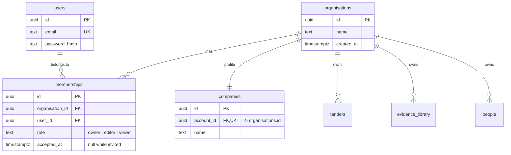

# Tenancy: the multi-user model and how we get there

*Spike TLY-85. Decides the model for TLY-86 (organisations and memberships),
TLY-87 (invitations) and TLY-88 (roles). No code ships from this document; the
migration it describes is the riskiest one in the backlog and is written down
before it is written.*

## Where we are today

`companies.account_id` is `NOT NULL UNIQUE REFERENCES users(id)`. That single
constraint is the whole tenancy model: one sign-in is one company, the user id
*is* the tenant key. It appears as `account_id` in fourteen tables — thirteen
of them with a foreign key to `users`, plus `deletion_log`, which holds the
column without one so the erasure record can outlive the account. It is also
the `sub` claim of every JWT and the argument of every account-scoped query in
`server/src/db.ts`.

Nothing is wrong with it except that it cannot hold two people. An Irish SME
bidding for public work has a bid manager, a finance person who owns the tax
clearance certificate, and a director who signs the declarations. Today they
share one password, which is both the thing every procurement questionnaire
asks about and the reason the audit log's `actor` column is close to useless.

## The decision

**A separate `organisations` table, with `memberships` joining users to it.**



Membership carries the role, so roles are per-organisation rather than global —
a person can be the owner of their own company and a viewer on a partner's
account, which is exactly the consortium case the product already models in
`partnerNeeded`.

### The rejected alternative: promote `companies` to the tenant

The tempting move is to skip the new table. `companies` already has one row per
tenant, already has a name, and is already the thing users think of as "us".
Add `memberships(company_id, user_id, role)`, repoint everything at
`companies.id`, and no new table appears.

It was rejected on two counts.

The first is that every `account_id` value in the database would have to
change. `companies.id` is a separate uuid from `companies.account_id`, so
repointing at `companies.id` means rewriting every row of all fourteen —
including `audit_log`, which is append-only by trigger and whose rows are
evidence. The chosen model keeps every existing value valid (see
below), and that difference is the entire risk profile of this migration.

The second is that `companies` is a *profile*: it holds turnover, insurance,
certifications, and the free text that goes into a bid. It changes when the
company's paperwork changes. A tenant boundary should not be a row people edit
in a form. Keeping identity (`organisations`) apart from profile (`companies`)
means a future second profile, a trading name, or a re-registered entity does
not touch tenancy at all.

### The move that makes this cheap

**Each backfilled organisation is created with the same uuid as the user it
came from.**

```sql
INSERT INTO organisations(id, name, created_at)
SELECT u.id, COALESCE(c.name, ''), u.created_at
  FROM users u LEFT JOIN companies c ON c.account_id = u.id;
```

Every `account_id` in every table already holds that uuid. So the data does not
move: the column keeps its values, its indexes, its unique constraints and its
type, and only the foreign key's target changes. There is no rewrite of
`audit_log`, no rewrite of `tenders`, and no window in which a query returns the
wrong tenant's rows because half the tables have been converted.

It also means a token issued before the cutover still names a valid tenant,
which is what makes the cutover a deploy rather than a forced sign-out.

### Why `account_id` keeps its name

`organisation_id` would read better. Renaming it touches fourteen tables, every
query in `db.ts`, the route-table-driven isolation suite, and every serializer —
a diff of roughly two hundred call sites whose only product is a better noun,
landed in the same change as the riskiest migration in the backlog.

The name stays. `account_id` means "the organisation that owns this row", it is
documented here, and if it is worth renaming it is worth renaming on a quiet
day when nothing else is moving.

## The migration, in order

Each step is a separate migration file and each is safe to stop after. Steps 1
to 3 are additive and can ship days before step 4.

**1 — `024_organisations.sql`. Create the tables.** Nothing references them yet.

```sql
CREATE TABLE organisations (id uuid PRIMARY KEY, name text NOT NULL DEFAULT '',
  created_at timestamptz NOT NULL DEFAULT now());
CREATE TABLE memberships (
  id uuid PRIMARY KEY,
  organisation_id uuid NOT NULL REFERENCES organisations(id) ON DELETE CASCADE,
  user_id uuid NOT NULL REFERENCES users(id) ON DELETE CASCADE,
  role text NOT NULL CHECK (role IN ('owner','editor','viewer')),
  invited_by text NOT NULL DEFAULT '',
  accepted_at timestamptz,
  created_at timestamptz NOT NULL DEFAULT now(),
  UNIQUE (organisation_id, user_id));
```

**2 — Backfill.** The `INSERT … SELECT` above, then one owner membership per
user. Both are idempotent (`ON CONFLICT DO NOTHING`), so a re-run is harmless.

**3 — Verify before touching a single foreign key.**

```sql
-- must return zero rows
SELECT account_id FROM tenders EXCEPT SELECT id FROM organisations;
-- and the same for the other thirteen tables
SELECT count(*) FROM users u
  WHERE NOT EXISTS (SELECT 1 FROM memberships m WHERE m.user_id = u.id AND m.role='owner');
```

If either returns anything, stop. Nothing has changed yet.

**4 — `025_repoint_tenancy.sql`. Repoint the foreign keys.** One transaction,
one table per pair of statements, in this order. The order matters only in that
`companies` goes first: it is the table whose `UNIQUE(account_id)` encodes the
old model, and converting it first makes the intent of the rest obvious.

| # | Table | Change | Notes |
|---|-------|--------|-------|
| 1 | `companies` | Drop FK to `users`, add FK to `organisations` | `UNIQUE(account_id)` **stays** — one organisation has one company profile |
| 2 | `tenders` | Drop FK, add FK | `UNIQUE(account_id, source, external_id)` and `tenders_canonical_key_idx` unchanged |
| 3 | `tender_documents` | none | reaches the tenant through `tender_id`; already cascades |
| 4 | `bid_answers` | none | via `tender_id` |
| 5 | `evidence_library` | Drop FK, add FK | `evidence_expiry_idx(account_id, expires_on)` unchanged |
| 6 | `people` | Drop FK, add FK | `people_active_idx` unchanged |
| 7 | `person_records` | none | via `person_id` |
| 8 | `notifications` | Drop FK, add FK | `UNIQUE(account_id, external_id)` unchanged |
| 9 | `discovery_preferences` | Drop FK, add FK | `account_id` is the primary key; unchanged |
| 10 | `usage_events` | Drop FK, add FK | metering is per organisation, which is also what TLY-91 will bill |
| 11 | `audit_log` | Drop FK, add FK | **no row rewrite** — the append-only trigger is on UPDATE and is not touched |
| 12 | `watchlist` | Drop FK, add FK | `UNIQUE(account_id, external_id)` unchanged |
| 13 | `saved_searches` | Drop FK, add FK | `UNIQUE(account_id, name)` — now shared across the team, which is the point |
| 14 | `declarations` | Drop FK, add FK | `PRIMARY KEY (account_id, declaration_id)` unchanged |
| 15 | `declaration_affirmations` | Drop FK, add FK | the affirming actor is already a text column, so it survives as a person |
| 16 | `deletion_requests` | Drop FK, add FK | deletion becomes an organisation-level act (TLY-97 already gates it on owner) |
| 17 | `deletion_log` | none | deliberately has no foreign key, so the erasure record outlives the cascade |
| 18 | `award_history` | none | shared reference data, no account column, by design |
| 19 | `cpv_codes`, `ingestion_runs` | none | reference and operational data, not tenant-scoped |

Every "Drop FK, add FK" is the same two statements:

```sql
ALTER TABLE <t> DROP CONSTRAINT <t>_account_id_fkey;
ALTER TABLE <t> ADD CONSTRAINT <t>_account_id_fkey
  FOREIGN KEY (account_id) REFERENCES organisations(id) ON DELETE CASCADE;
```

The `ADD CONSTRAINT` validates the existing rows. Step 3 has already proved
they validate, so this is a scan, not a rewrite.

**5 — `026_users_are_not_tenants.sql`.** Only after the application deploy in
step 6 has been live long enough that no pre-cutover token can remain (12 hours
plus a margin), remove what is left of the old model: nothing structural, but
this is where a comment on `users` stops claiming it is a tenant.

**6 — Application deploy.** `accountId(req)` reads the organisation claim
instead of `sub` (see below), and `createUser` becomes create-user-plus-create-
organisation-plus-owner-membership. This deploy can go out any time after step
4, and is backward compatible with tokens issued before it.

## Tokens

Today:

```json
{ "sub": "<user id>", "email": "…", "iss": "tenderly-api", "aud": "tenderly-web" }
```

and `accountId(req)` returns `sub`.

After:

```json
{ "sub": "<user id>", "email": "…", "org": "<organisation id>", "role": "owner",
  "iss": "tenderly-api", "aud": "tenderly-web" }
```

`accountId(req)` returns `org`; a new `role(req)` returns `role`. The user id
stops being the tenant key and becomes what it always should have been — who is
acting — which is what `audit_log.actor` and `bid_tasks.owner` want.

**A token issued before the cutover has no `org` claim, and is refused with
`401`.** The client clears it and shows the sign-in screen, which it already
does for any expired session.

This spike originally proposed a fallback — resolve the missing claim to the
user's single membership and let the token live out its twelve hours. TLY-86's
acceptance criteria overrode it, and they were right to. The fallback is a code
path whose whole job is to guess which organisation a token meant, in the one
subsystem where a wrong guess hands one company another company's bids. It
would be exercised for twelve hours, once, and then sit there for years. The
cost of not having it is that everybody signs in again once, on the day of the
cutover, which is a thing users do anyway.

Anything a request cannot prove, it does not get: no `org` claim is not a
puzzle to solve, it is a session that predates the model.

The `role` claim is a cache of the membership row, not the authority. Roles are
re-read from `memberships` on any request that changes data, because a token
minted before someone was demoted must not still carry `owner` for twelve
hours. Read-only requests may trust the claim.

## Rollback

**Inside the window where no second member and no second organisation exists**
— which is every moment between step 4 and TLY-87 shipping — rollback is exact
and loses nothing:

```sql
BEGIN;
-- for each of the thirteen tables that hold a foreign key
ALTER TABLE <t> DROP CONSTRAINT <t>_account_id_fkey;
ALTER TABLE <t> ADD CONSTRAINT <t>_account_id_fkey
  FOREIGN KEY (account_id) REFERENCES users(id) ON DELETE CASCADE;
DROP TABLE memberships;
DROP TABLE organisations;
COMMIT;
```

This works precisely because every organisation id equals a user id. No row of
customer data moves, and the previous release runs against the reverted schema
unchanged.

**After invitations ship, rollback is destructive**, and the honest statement of
what is lost is:

- **Every membership beyond the first.** The old schema has nowhere to put a
  second person on an account, so invited colleagues stop existing as users of
  that organisation. Their `users` rows survive; their access does not.
- **Every organisation created after the cutover**, because its id is not a
  user id and the reverted foreign key will not validate. Its tenders, answers,
  evidence, people and vault files go with it. There is no partial version of
  this: the `ADD CONSTRAINT` fails until those rows are deleted.
- **Every role assignment**, and with it the TLY-88 distinction between owner,
  editor and viewer — the reverted system treats the surviving sign-in as
  having full control.
- **Pending invitations** (`memberships` with `accepted_at IS NULL`).

Recovery from that point is restore-from-backup, not rollback, and the backup
runbook (TLY-100) is the document that has to be true first. **Do not apply
step 4 in production until TLY-100 is done.**

## Isolation tests that must pass

These exist today and must pass unchanged **before** the migration is applied,
and again after, with no edits to their assertions:

- `server/tests/tenant-isolation.test.ts` — tries every authenticated route as
  the wrong tenant and insists on a refusal with no resource data in the body.
  Its last test reads the route table out of `src/index.ts`, so a route added
  during this work with no isolation case fails the suite. That property is the
  reason this migration is testable at all, and nothing in it may be relaxed to
  make the migration pass.
- `server/tests/account-erasure.test.ts` — the export archive holds one
  organisation's data and nobody else's; a completed deletion leaves another
  organisation untouched.
- `server/tests/people.test.ts`, `vault.test.ts`, `saved-searches.test.ts`,
  `usage.test.ts`, `audit.test.ts` — the account-scoped read and write paths,
  each of which asserts its own cross-account refusal.

These must be **added before step 4** and pass against both schemas:

1. **Two organisations, one user.** A user with an accepted membership in A and
   in B, holding a token for A, gets 404 on every one of B's resources.
2. **A membership is not a claim.** A token whose `org` claim names an
   organisation the user has no accepted membership in is rejected with 401 —
   the claim is checked against `memberships`, not trusted.
3. **A revoked membership takes effect immediately.** Delete the membership,
   then reuse the still-unexpired token: writes are refused.
4. **The legacy token path.** A token with no `org` claim is refused with 401
   and no data in the body, and a token whose `org` names a user id rather than
   an organisation reaches nothing.
5. **Role enforcement** (with TLY-88): a viewer cannot write, an editor cannot
   export or delete the account, an owner can.
6. **Deletion under the new parent.** `DELETE FROM organisations WHERE id=$1`
   removes every row of the thirteen cascading tables, leaves `deletion_log`
   standing — that is the whole reason it has no foreign key — and leaves
   `award_history` and the other organisation's rows untouched. The same
   assertions as TLY-97's, one level up.

Test 6 is the one that catches a foreign key repointed in the migration but
forgotten in the table above: a missed table keeps its `users(id)` parent,
survives the organisation delete, and shows up as rows that should not exist.

## Status

Steps 1 to 4 and the application deploy shipped in TLY-86 as migrations
`024_organisations.sql` and `025_repoint_tenancy.sql`, with the rollback in
`server/migrations/rollback/025_repoint_tenancy_down.sql`. The rollback file
carries the two guards described above and refuses to run once they are false.

Invitations shipped in TLY-87, so **the window in which rollback is exact is
closed**. From here on, a rollback is exact only for a database in which no
invitation has yet been accepted — the guards in the rollback file check that
and refuse when it is false.

Role enforcement shipped in TLY-88. Two things about it are worth keeping in
mind when reading the token section above: the `role` claim is now advisory,
because `attachMembership` re-reads the membership row on every request; and
that same read is what removes a person's access on their next call rather than
at the end of their twelve-hour session. Every mutating request needs at least
the editor role, enforced on the HTTP method rather than on a list of paths, so
a route added tomorrow is covered without anybody remembering to cover it.
